# Upload-Document-to-Repository

To upload your document, you can following this steps:

1. Make sure you have install git. If not yet, you can install following this [link](https://git-scm.com/)

2. Accept the assignment which is shared by a link. you will get the display like picture bellow this.

   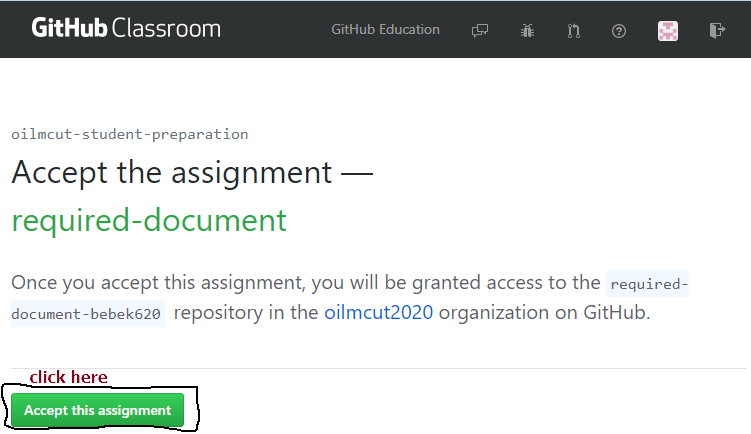

   

3. It will create your own repository. just waiting until finish 

   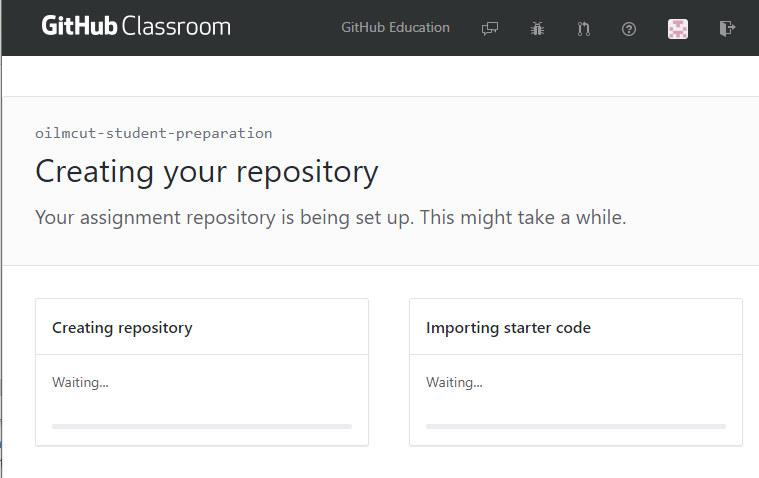

   

   

4. After GitHub finish create repository, you can get in to your assignment repository

   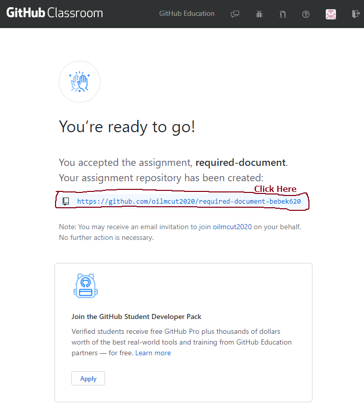

5. Clone the assignment repository to your local drive

   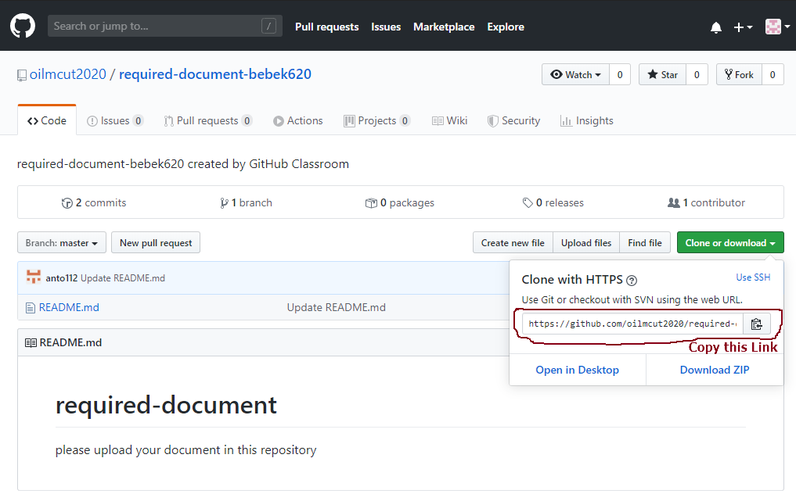

   

6. Navigate to your file directory and right click. click Git bash here

   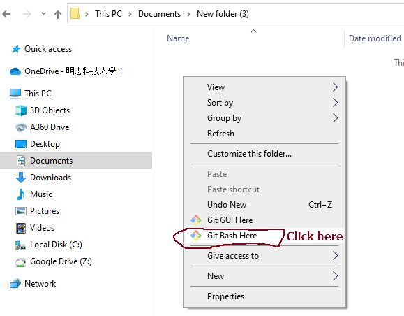

   

   

7. It will open command prompt for git. write the command $ git clone and paste the link repository. than click "Enter"

   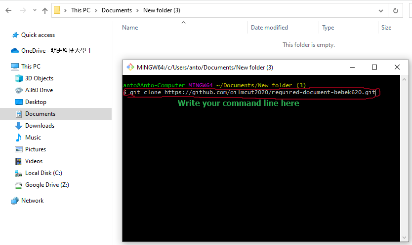

   

8. When you succeed cloning repository it will show prompt like the picture below this.

   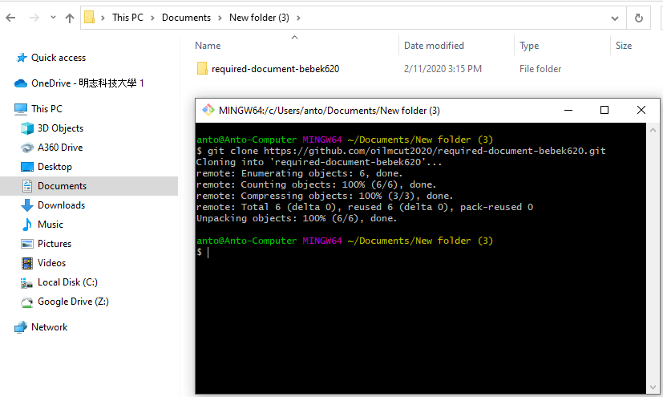

   

9. Open the folder and make new folder for putting the required document. for the example is like picture bellow this.

   *original file in repository*

   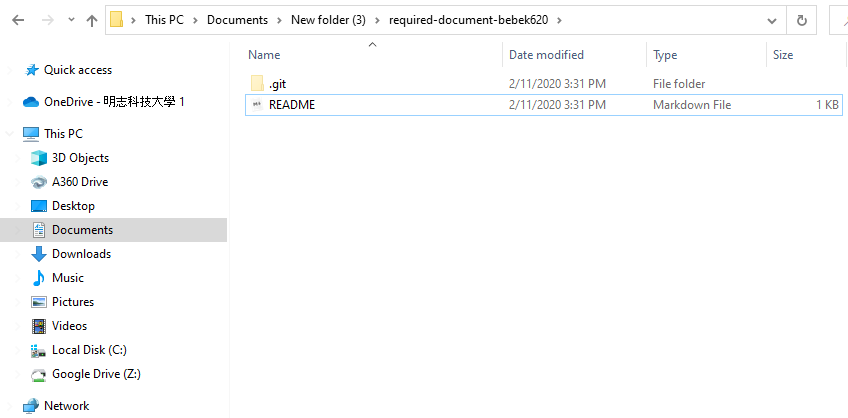

   

   *after modify*

   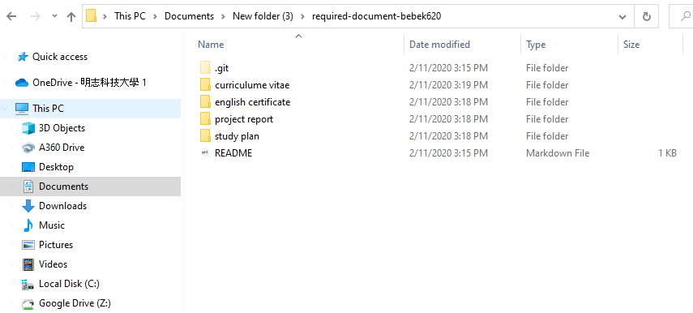

   

10. Go to git prompt, and change directory to your repository.

    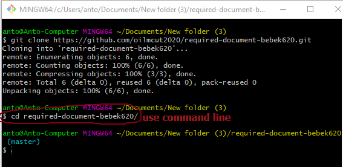

11. Before you upload you need to follow the command line such as :

    $ git add .

    $ git commit -m "upload file"

    $ git push -u origin master

    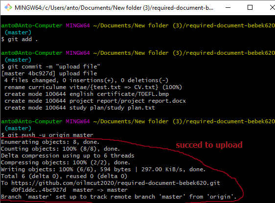

12. You can check that your file already upload in online repository GitHub. 

    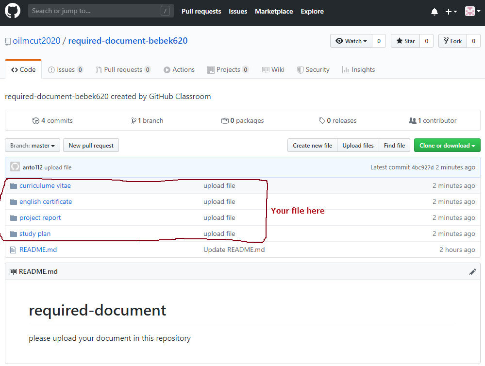

13. Finish
